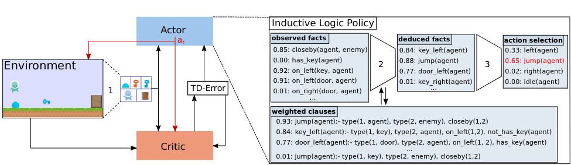

# NUDGE

This is the implementation of **Neurally gUided Differentiable loGic policiEs (NUDGE)**, a framework for logic RL agents based on differentiable forward reasoning with first-order logic (FOL).


## Quickstart

1. Install all requirements via
    ```bash
    pip install -r requirements.txt
    cd nsfr
    pip install -e .
    ```
2. On project level, simply run `python train.py` to start a new training run.

## How to Use

### Training
To train a new agent, run `python train.py`. The training process is controlled by the hyperparameters specified in `in/config/default.yaml`. You can specify a different configuration by providing the corresponding YAML file path as an argument, e.g., `python train.py -c in/config/my_config.yaml`. The -c argument is optional and defaults to `in/config/default.yaml`.
You can also overwrite the game environment by providing the `-g` argument, e.g., `python train.py -g freeway`.


### Hyperparameters
The hyperparameters are configured inside `in/config/default.yaml` which is loaded as default. You can specify a different configuration by providing the corresponding YAML file path as an argument, e.g., `python train.py in/config/my_config.yaml`. A description of all hyperparameters can be found in `train.py`.

### The Logic
Inside `in/envs/[env_name]/logic/[ruleset_name]/`, you find the logic rules that are used as a starting point for training. You can change them or create new rule sets. The ruleset to use is specified with the hyperparam `rules`.

### Install Locally
If you want to use NUDGE within other projects, you can install NUDGE locally as follows:
1. Inside ```nsfr/``` run
    ```bash
    python setup.py develop
    ```
2. Inside ```nudge/``` run
    ```bash
    python setup.py develop
    ```

### Optional: Threefish and Loot Environments
In case you want to use the Threefish or the Loot environment, you also need to install QT-5 via
```bash
apt-get install qt5-default
```

### Playing

```
python3 play_gui.py -g seaquest
```


## Environments and their Variants
### Getout
* `getout` contains key, door and one enemy.  
* `getoutplus` has one more enemy.
### Threefish
* `threefish` contains one bigger fish and one smaller fish.
* `threefishcolor` contains one red fish and one green fish. agent need to avoid red fish and eat green fish.
### Loot
* `loot` contains 2 pairs of key and door.  
* `lootcolor` contains 2 pairs of key and door with different color than in loot.  
* `lootplus` contains 3 pairs of key and door.


## How to Set up New Environments
You add a new environment inside `in/envs/[new_env_name]/`. There, you need to define a `NudgeEnv` class that wraps the original environment in order to do
* **logic state extraction**: translates raw env states into logic representations
* **valuation**: Each relation (like `closeby`) has a corresponding **valuation function** which maps the (logic) game state to a probability that the relation is true. Each valuation function is defined as a simple Python function. The function's name must match the name of the corresponding relation.
* **action mapping**: action-predicates predicted by the agent need to be mapped to the actual env actions

See the `freeway` env to see how it is done.


## Misc
TODO
**Using Beam Search to find a set of rules**


With scoring:

```
python3 beam_search.py -m getout -r getout_root -t 3 -n 8 --scoring True -d getout.json  
``` 

Without scoring:

``` 
python3 beam_search.py -m threefish -r threefishm_root -t 3 -n 8 
``` 

* **--t**:  Number of rule expansion of clause generation.
* **--n**:  The size of the beam.
* **--scoring**: To score the searched rules, a dataset of states information is required.
* **-d**: The name of dataset to be used for scoring.

## How to use Meta-Logic to get Proof Tree

After obtaining the pre-trained model, it will be stored in the following path:
`out/runs/game/logic/`

You can run the `play_gui.py` with different logic settings using the following commands.
### Setting the Game

You can specify the game using the `-g` parameter. For example:

```bash
python play_gui.py -g <game_name>
```
### Using Meta Logic

To use Meta Logic, run the following command:

```bash
python play_gui.py -m True
```
### Using Only NSFR
If you want to use only NSFR (Non-Standard First-Order Reasoning), run the following command:
```bash
python play_gui.py -m False
```

### Saving Generated Meta Atoms and Code Modification

All generated `meta_atom` outputs will be saved in a `.txt` file in the following path:
`\explainableNUDGE\meta_atom_output_{env_name}.txt`

Where `{env_name}` refers to the name of the environment (e.g., `seaquest`, etc.).

For example, for the `seaquest` environment, the file path would be:
`\explainableNUDGE\meta_atom_output_seaquest.txt`

This file will store all `meta_atom` data generated during logic reasoning for the specific environment.

## Step 2: Modify `common.py` for Output Handling

In order to ensure that the generated `meta_atom` is saved as a text file, you should modify the code at line 50 in:
`\explainableNUDGE\nsfr\nsfr\common.py`

## Configuring the Meta Interpreter

To configure the meta interpreter, follow these steps:

### Step 1: Set Up Meta Predicates and Interpreter

Save the configured meta predicates and interpreter as text files in the corresponding game environment's `default` folder. For example, in the case of the `seaquest` game, save the following files:

- `meta_preds_proof.txt`
- `proof_tree_interpreter.txt`

The files should be placed in the following path: `\in\envs\seaquest\logic\default`

Make sure the file names and locations match the required structure for the game environment.

### Step 2: Adjust Code in `data_utils.py` and `logic.py`

You need to make adjustments to the following lines in the codebase to integrate the meta interpreter properly:

1. **File**: `\explainableNUDGE\nsfr\nsfr\fol\data_utils.py`
   - **Line**: 312
   - Make the necessary changes to ensure that the meta predicates and interpreter are correctly loaded and utilized within the game environment.

2. **File**: `\explainableNUDGE\nsfr\nsfr\utils\logic.py`
   - **Line**: 178
   - Modify this line to align with the meta interpreter settings and ensure that the logic processing handles the meta logic correctly.

These changes will allow the meta interpreter to function within the `seaquest` (or any other specified game) environment.

